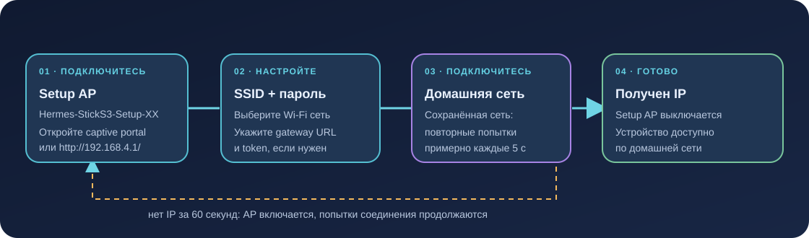

# Настройка и прошивка M5Stack StickS3

Инструкция для StickS3 (ESP32-S3). Она описывает provisioning по Wi-Fi и PlatformIO build. Подключение к реальному устройству и успешная прошивка должны проверяться отдельно.



## Что понадобится

- M5Stack StickS3 и USB-кабель с передачей данных.
- Wi-Fi 2.4 GHz, к которому устройство сможет подключиться.
- Запущенный Voice Gateway в той же доступной сети.
- PlatformIO Core для сборки; Serial Monitor — для диагностики.

## Настройка через captive portal

1. При первом старте подключитесь телефоном или компьютером к `Hermes-StickS3-Setup-XX`. `XX` — последний байт Wi-Fi MAC в нижнем регистре hex.
2. Подтвердите предложение открыть сеть/портал. Если оно не появилось, откройте `http://192.168.4.1/`.
3. Выберите домашний SSID из списка или введите его вручную; задайте пароль и endpoint шлюза.
4. Оставьте protocol v1, если не настраивали v2 tokens. Для v1 укажите полный URL `/api/v1/voice/turn`. Для v2 укажите только базовый URL вида `http://192.168.1.10:8080`, выберите v2 и введите token устройства.
5. Нажмите **Save & Restart**. После перезапуска устройство подключится к сохранённой сети.

Пароль или token можно оставить пустым, чтобы сохранить текущее значение. В v2 gateway должен содержать соответствующий device ID → token mapping в `VOICE_DEVICE_TOKENS`; MAC — идентификатор, не секрет. Страница настройки открыта без пароля, но firmware принимает её запросы только из setup subnet.

Если устройство не получило IP по сохранённым настройкам за 60 секунд, оно включает setup AP, продолжая повторять подключение примерно каждые пять секунд. После получения IP AP выключается. Сеть AP открытая; если captive prompt не показывается, подключитесь к ней вручную и откройте адрес выше.

## Сборка

Из корня репозитория:

```sh
cd firmware
export HERMES_WIFI_SSID='your-network'
export HERMES_WIFI_PASSWORD='your-password'
export HERMES_GATEWAY_URL='http://192.168.1.10:8080/api/v1/voice/turn'
pio run -e sticks3
```

Build flags считывают три значения из окружения и встраивают defaults в образ. Firmware также сохраняет настройки страницы в NVS; не коммитьте реальные build-переменные, токены или пароли. Устройство ID формируется из полного Wi-Fi MAC и показывается в интерфейсе.

## Прошивка и serial log

Подключите устройство и проверьте найденный порт:

```sh
pio device list
pio run -e sticks3 -t upload --upload-port /dev/ttyACM0
pio device monitor --port /dev/ttyACM0 --baud 115200
```

Замените `/dev/ttyACM0` на свой порт. StickS3 может потребовать ручного входа в download mode: удерживайте KEY1 во время переподключения USB, затем повторите загрузку. Настройка PlatformIO предотвращает автоматический reset во время upload, поэтому download mode нужно включить вручную при необходимости.

Для проверки host-side логики firmware без устройства:

```sh
cd firmware
pio test -e native
```

Успешная native test/build не доказывает, что прошивка корректна на реальном аудиокодеке или что Wi-Fi и gateway работают на конкретном устройстве. После upload отдельно проверьте boot log, домашнее подключение, голосовой запрос и воспроизведение.

## На экране

Состояния отображаются на LCD: `ГОТОВ`, `СЛУШАЮ`, `ДУМАЮ`, `ОТВЕЧАЮ`, `ОШИБКА`. Экран ошибки остаётся до нажатия кнопки. Отдельная LED-индикация не используется.
